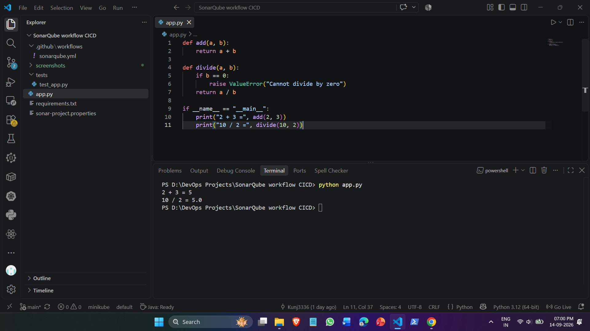
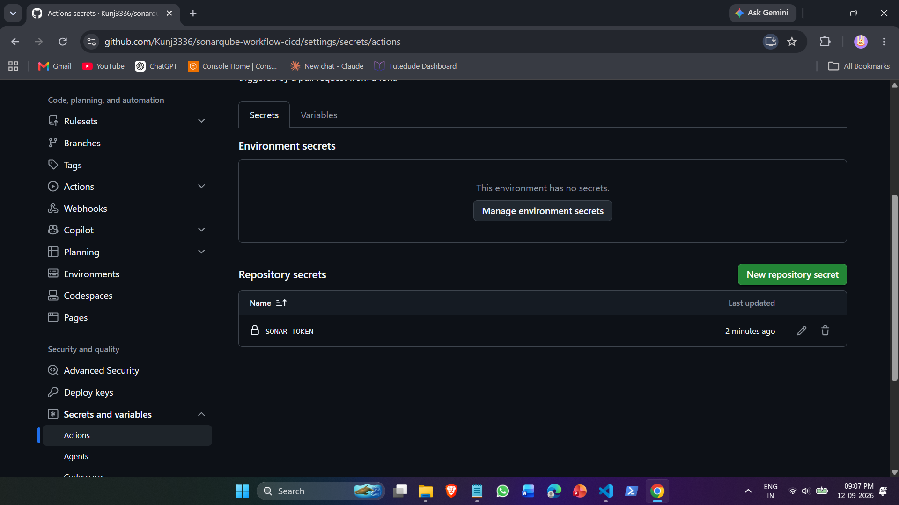
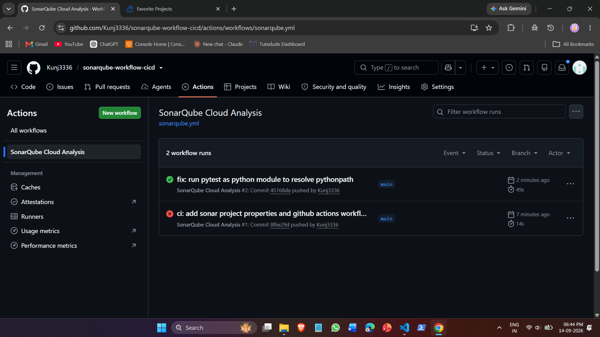
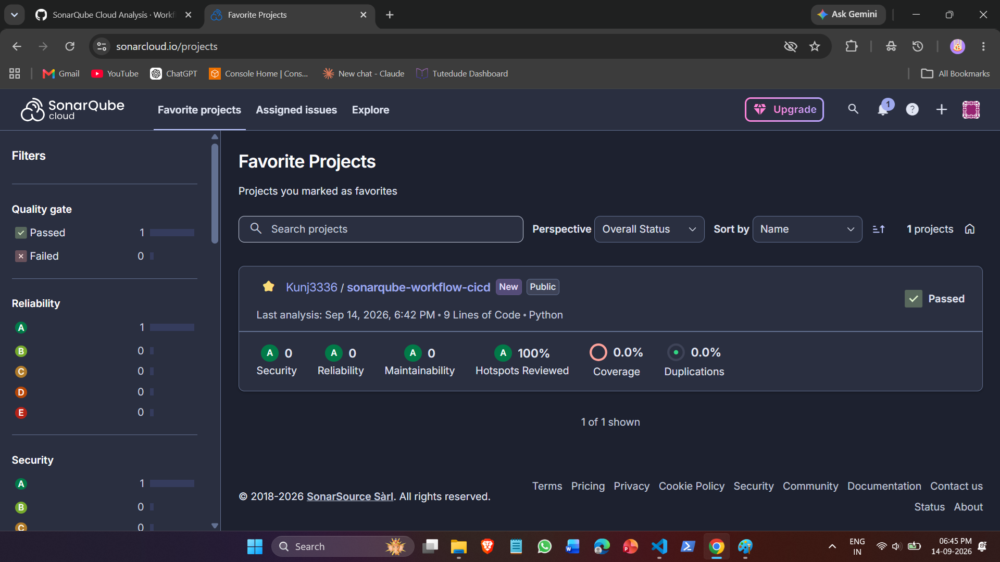

# SonarQube Cloud CI/CD Integration Workflow

An automated Continuous Integration (CI) static analysis pipeline for a Python micro-application integrated with **SonarQube Cloud** and **GitHub Actions**
---

## Project Overview & Concept

### The Problem
When developers push code changes, manual code reviews can overlook latent bugs, security vulnerabilities, or code maintainability issues ("code smells").

### The Solution
This proof of concept demonstrates an automated static code analysis pipeline:
* **Automated Testing:** Ensures application logic functions correctly before any scanning occurs.
* **Automated Inspection:** SonarQube Cloud analyzes the codebase against strict security, reliability, and maintainability standards.
* **Quality Gate Enforcement:** Analysis results are published to the SonarQube dashboard to provide immediate pass/fail feedback on code quality.

---

## Architecture & Workflow Flow

```
[Developer Push / PR]
       │
       ▼
[GitHub Actions CI Runner (ubuntu-latest)]
       ├── 1. Checkout repository (fetch-depth: 0)
       ├── 2. Set up Python 3.12 environment
       ├── 3. Install dependencies (pytest)
       ├── 4. Execute unit test suite (pytest)
       └── 5. Run SonarSource Scan Action
                     │
                     ▼ (Authenticated via SONAR_TOKEN)
          [SonarQube Cloud Dashboard]
          ├── Code Quality Metrics (Maintainability: A)
          ├── Reliability & Bug Analysis (Reliability: A)
          ├── Security Vulnerability Scans (Security: A)
          └── Quality Gate Evaluation (Passed)
```

---

## How It Works

* **Trigger:** Every commit pushed to the `main` branch or created as a Pull Request triggers the GitHub Actions workflow automatically.
* **Execution & Testing:** A hosted `ubuntu-latest` runner provisions Python 3.12, installs dependencies via `requirements.txt`, and runs the test suite via `pytest`.
* **Static Analysis:** The `SonarSource/sonarqube-scan-action` scans the codebase based on parameters in `sonar-project.properties` and authenticates using the encrypted `SONAR_TOKEN` repository secret.
* **Quality Gate:** Scan telemetry is sent to SonarQube Cloud, which scores the build across Security, Reliability, and Maintainability metrics.

---

## Key Implementation Details

* **Authentication & Security:** Analysis authenticated securely via `SONAR_TOKEN` stored within GitHub Actions encrypted repository secrets.
* **Granular Scope Configuration:** Target sources, test discovery (`tests/**/*.py`), and exclusions (`.venv/**`, `.github/**`) defined cleanly via `sonar-project.properties`.
* **Fail-Fast Test Verification:** Automated `pytest` execution precedes code quality scanning to ensure functional correctness before analysis reporting.
* **Modern Scanner Action:** Built using the official `SonarSource/sonarqube-scan-action@v4` workflow integration.

---

## SonarQube Configuration (`sonar-project.properties`)

```properties
sonar.organization=kunj3336
sonar.projectKey=Kunj3336_sonarqube-workflow-cicd

# Source and test paths
sonar.sources=.
sonar.tests=tests
sonar.test.inclusions=tests/**/*.py

# Excluded metadata and environments
sonar.exclusions=.venv/**,venv/**,.github/**
```

---

## Verification Proof & Evidence

### 1. Local Python Application Execution
Verification of the sample Python application arithmetic logic executing locally.



---

### 2. GitHub Actions Secret Configuration
SonarQube Cloud user token securely registered as `SONAR_TOKEN` in repository secrets.



---

### 3. GitHub Actions CI Pipeline Execution
Successful automated pipeline execution running checkout, dependency installation, pytest suite, and SonarQube scan.



---

### 4. SonarQube Cloud Analysis & Quality Gate
SonarQube Cloud dashboard reporting an overall **Passed** Quality Gate status with zero security vulnerabilities, zero bugs, and grade 'A' ratings across all categories.



---

## Repository Structure

```text
├── .github/
│   └── workflows/
│       └── sonarqube.yml           # GitHub Actions CI workflow
├── screenshots/                    # Task proof and validation captures
├── tests/
│   └── test_app.py                 # Pytest unit tests
├── app.py                          # Core Python application logic
├── requirements.txt                # Project dependencies
├── sonar-project.properties        # SonarQube Cloud project configuration
└── README.md                       # Project documentation
```
